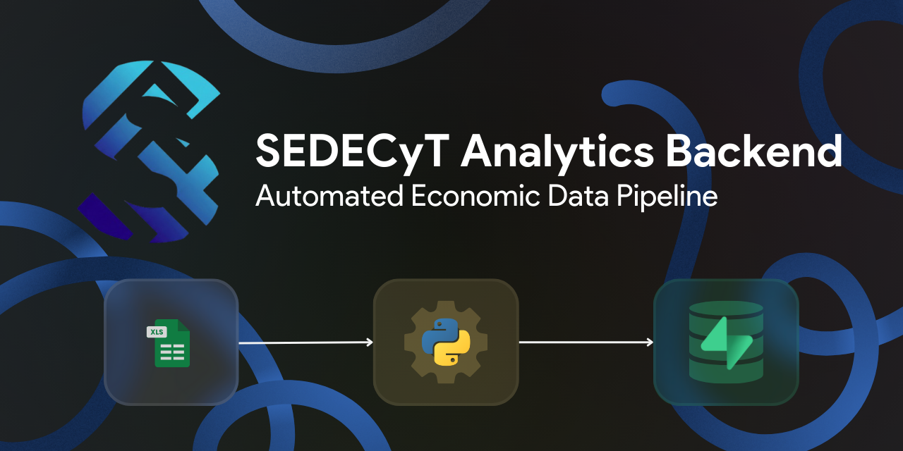

<div align="center">

  
  
  <br/>
  
  <h1>🚀 SEDECyT Analytics - Backend API</h1>
  
  <p>
    <strong>Automated ETL Pipeline that transforms manual economic reporting into real-time, data-driven insights</strong>
  </p>
  
  <!-- BADGES -->
  <a href="https://github.com/enyeel/sedecyt_analytics_backend">
    
  </a>
  
  
  
  
</div>

---

## 💡 The Problem

Currently, SEDECyT's process for generating key economic reports is **manual, slow, and error-prone**:

* 📝 **Manual Data Entry:** Data is consolidated by hand from various sources (Google Forms, spreadsheets, etc.) into a central Excel file
* 📊 **Static Reports:** This data is then manually transferred to PowerPoint presentations for analysis
* ⏰ **Inefficiency:** This workflow consumes **dozens of hours per month**, increases the risk of human error, and makes **real-time data analysis impossible**

**The Cost:** Government staff spend valuable time on repetitive data entry instead of strategic analysis, and decision-makers receive outdated information.

---

## 🛠️ The Solution

This backend implements a **fully automated, production-ready ETL pipeline** that eliminates manual work and delivers instant insights:

1. **⚡ Automated Extraction:** Connects to Google Sheets and pulls new data automatically
2. **🧹 Intelligent Cleaning:** Normalizes RFCs, validates phones, matches municipalities with fuzzy logic, processes certifications
3. **💾 Smart Storage:** Loads clean data into Supabase with proper relationships and maintains full historical tracking
4. **📈 Pre-calculated Analytics:** Generates dashboard charts automatically, ready for instant visualization

**The Result:** What used to take **days of manual work** now happens **automatically in minutes**, with zero human error and real-time updates.

---

## 📺 Demo / Preview

<!-- 
  📸 MULTIMEDIA PLACEHOLDER - DEMO GIF/SCREENSHOTS
  =================================================
  INSTRUCCIONES PARA CREAR EL DEMO:
  
  OPCIÓN 1: GIF Animado (Recomendado)
  ------------------------------------
  1. Herramientas:
     - ScreenToGif (Windows)
     - LICEcap (Mac/Windows)
     - OBS Studio + conversor a GIF
     
  2. Contenido a mostrar:
     - Terminal ejecutando el ETL pipeline
     - Logs mostrando el proceso de limpieza
     - Resultado final en Supabase (captura de pantalla)
     - API respondiendo con datos limpios
     
  3. Duración: 15-30 segundos (loop infinito)
  4. Dimensiones: 800-1200px de ancho
  5. Sube a: /docs/images/demo-etl.gif
     
  OPCIÓN 2: Screenshots en Grid
  -----------------------------
  1. Capturas a incluir:
     - Logs del ETL mostrando estadísticas
     - Supabase dashboard con datos limpios
     - API response en Postman/Thunder Client
     - Estructura de datos antes/después
     
  2. Crea un grid con 2-4 imágenes
  3. Usa herramientas como:
     - Canva para crear el grid
     - Figma para diseño profesional
     
  4. Sube a: /docs/images/etl-screenshots.png
     
  REEMPLAZA ESTA SECCIÓN CON:
  
  
  O para screenshots:
  <div align="center">
    
  </div>
-->

<div align="center">
  <p><em>📸 Demo video/screenshots will be added here</em></p>
  <p><small>See instructions in the code comments above</small></p>
</div>

---

## ✨ Key Features

* ⚡ **Speed:** Processes and cleans thousands of records in minutes, reducing report generation time from **days to seconds**
* 🎯 **Accuracy:** Intelligent fuzzy matching for municipalities and industrial parks, eliminating manual data entry errors
* 📊 **Complete History:** Maintains both the latest snapshot and full response history for temporal analysis
* 🔄 **Full Automation:** Completely automated ETL pipeline that can run on-demand or be scheduled
* 🛡️ **Robust Validation:** Normalizes Mexican RFCs, validates phones (E.164), cleans emails, standardizes addresses
* 📈 **Pre-calculated Analytics:** Automatically generates chart data, ready for instant dashboard visualization
* 🔐 **Security:** Token-based Supabase authentication, protected endpoints, CORS configured

---

## 🏗️ Architecture

<!-- 
  📊 MULTIMEDIA PLACEHOLDER - DIAGRAMA DE ARQUITECTURA
  =====================================================
  INSTRUCCIONES PARA CREAR EL DIAGRAMA:
  
  OPCIÓN 1: Mermaid.js (Recomendado - se renderiza en GitHub)
  -----------------------------------------------------------
  Puedes usar este código Mermaid directamente en el README:
  
  ```mermaid
  graph LR
    A[Google Sheets] -->|Extract| B[ETL Pipeline]
    B -->|Transform| C[Data Cleaning]
    C -->|Load| D[Supabase DB]
    D -->|Query| E[Analytics Pipeline]
    E -->|Pre-calc| F[Charts Data]
    D -->|API| G[Frontend Dashboard]
    F -->|API| G
  ```
  
  OPCIÓN 2: Imagen Externa
  ------------------------
  1. Herramientas:
     - Draw.io (diagrams.net)
     - Lucidchart
     - Figma
     
  2. Elementos a incluir:
     - Google Sheets (fuente)
     - ETL Pipeline (proceso)
     - Supabase (almacenamiento)
     - Analytics Pipeline (cálculos)
     - API (servicio)
     - Frontend (consumidor)
     
  3. Estilo: Moderno, con colores de marca
  4. Sube a: /docs/images/architecture-diagram.png
     
  REEMPLAZA ESTA SECCIÓN CON EL DIAGRAMA
-->


**Data Flow:**
1. **Extract:** Google Sheets → Raw data
2. **Transform:** Cleaning, normalization, fuzzy matching
3. **Load:** Supabase (companies, contacts, responses)
4. **Analytics:** Pre-calculate chart data
5. **Serve:** REST API → Frontend dashboard

---

## 🚀 Tech Stack

     

**Core Technologies:**
* **Python 3.11** - Backend language
* **Flask** - Web framework with Blueprint architecture
* **Pandas** - Data transformation and analysis
* **Supabase** - PostgreSQL database with real-time capabilities
* **RapidFuzz** - Intelligent fuzzy string matching
* **Docker + Gunicorn** - Containerization and production server
* **Google Cloud Run** - Serverless hosting platform

---

## 📚 Technical Documentation

### Project Structure

```
app/
├── api/                    # API endpoints (Blueprints)
│   ├── routes.py          # All API routes
│   └── auth_decorator.py  # Token authentication
├── core/
│   └── connections/       # External service connections
│       ├── supabase_service.py
│       └── google_sheets_service.py
├── pipelines/
│   ├── etl/               # ETL pipeline modules
│   │   ├── run.py        # Main orchestrator
│   │   ├── cleaning.py   # Data cleaning functions
│   │   ├── processing.py # Entity separation
│   │   └── certifications.py
│   └── analytics/        # Analytics pipeline
│       ├── run.py
│       ├── analysis_functions.py
│       └── update_chart_visibility.py
└── services/
    └── dashboard_service.py
```

### API Endpoints

#### Public Endpoints

| Method | Endpoint | Description |
| :--- | :--- | :--- |
| `GET` | `/api/health` | Health check (used by keep-alive) |

#### Protected Endpoints (Require `Authorization: Bearer <token>`)

| Method | Endpoint | Description |
| :--- | :--- | :--- |
| `GET` | `/api/dashboards` | List of all dashboards |
| `GET` | `/api/dashboards/<slug>` | Complete dashboard with charts |
| `GET` | `/api/dashboards/meta` | Dashboard metadata |
| `GET` | `/api/data/companies-view` | Formatted companies data |
| `GET` | `/api/data/contacts-view` | Formatted contacts data |
| `GET` | `/api/data/responses-view` | Formatted responses (history) |
| `GET` | `/api/companies/search?q=<query>` | Search company by name |
| `GET` | `/api/table/<table_name>` | Raw table data (admin) |

### ETL Pipeline Features

**Data Cleaning:**
* ✅ RFC validation (Mexican format + foreign tax IDs)
* ✅ Phone normalization (E.164 format)
* ✅ Email cleaning and validation
* ✅ Address standardization
* ✅ Fuzzy matching for municipalities and industrial parks
* ✅ Certification processing (checkbox + free-text)
* ✅ Unicode normalization and text cleaning

**Data Processing:**
* ✅ Entity separation (companies, contacts, responses)
* ✅ Foreign key relationship management
* ✅ Historical data tracking vs. latest snapshot
* ✅ Catalog matching with keyword support

### Analytics Pipeline

The analytics pipeline pre-calculates chart data using configurable analysis functions:
* `analyze_categorical` - Count aggregations
* `analyze_continuous_binned` - Histogram generation
* `analyze_top_ranking` - Top N rankings
* `analyze_array_frequency` - Array element frequency
* `analyze_array_populated_bool` - Boolean aggregations

Configuration is defined in `config/dashboards_config.py`.

---

## 🚀 Quick Start

For detailed installation instructions, see [INSTALL.md](./INSTALL.md).

**TL;DR:**
```bash
# Clone and setup
git clone https://github.com/enyeel/sedecyt_analytics_backend.git
cd sedecyt_analytics_backend

# Configure .env file
cp .env.example .env  # Edit with your credentials

# Run with Docker
docker build -t sedecyt-backend .
docker run -p 8080:8080 --env-file .env sedecyt-backend
```

---

## 🔗 Frontend Integration

This backend is designed to work seamlessly with the [SEDECyT Analytics Frontend](https://github.com/enyeel/sedecyt_analytics_frontend):

* **Authentication:** Both use Supabase Auth for unified user sessions
* **API Contract:** Frontend consumes all endpoints with `Authorization: Bearer <token>`
* **Data Flow:** ETL → Supabase → Analytics → API → Frontend Charts
* **CORS:** Configured to allow frontend domain requests

**Environment Variables Connection:**
- Frontend uses `NEXT_PUBLIC_API_URL` pointing to this backend
- Backend uses `FRONTEND_URL` for CORS configuration

---

## 👥 Collaborators

* **[Ángel](https://github.com/enyeel)** — Data processing, backend architecture & overall project design  
* **[Emilio](https://github.com/AngelGTZ28)** — API & infrastructure development (Google Cloud, Supabase integration)  
* **[Yara](https://github.com/Yara09-L)** — Frontend development & UI integration  

> _This project is part of the university internship program at SEDECYT Aguascalientes._

---

## 🤝 Contact

Interested in implementing a similar solution for your organization?

* 📧 **Email:** [anjel.hdz22@gmail.com](mailto:anjel.hdz22@gmail.com)
* 💼 **LinkedIn:** [Your LinkedIn Profile]
* 🌐 **Portfolio:** [Your Portfolio Website]

---

## 🔮 Roadmap

* ⏳ Scheduled ETL runs via Cloud Scheduler
* ⏳ Real-time data validation webhooks
* ⏳ Enhanced export functionality (CSV/Excel)
* ⏳ Machine learning models for fuzzy matching
* ⏳ API rate limiting and caching layers
* ⏳ Comprehensive logging and monitoring
* ⏳ Unit and integration test coverage
